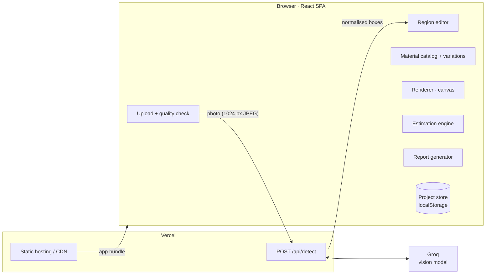

# System architecture

Facade Planner is a single-page web app with one serverless function. Everything interactive (editing, rendering, estimating, saving) runs in the browser, so it responds instantly and needs no database. The server does only one thing: it keeps the AI key secret while calling the vision model.

## Components

| Layer | Module | Responsibility |
|---|---|---|
| Client | [`src/lib/image.js`](../src/lib/image.js) | Decode and resize uploads, quality gate (resolution, mean luminance, variance of Laplacian), photo shading layer, sample house |
| Client | [`src/lib/detect.js`](../src/lib/detect.js) | Calls `/api/detect`, maps boxes to pixels, falls back to the standard layout on any failure |
| Client | [`src/components/Stage.jsx`](../src/components/Stage.jsx) | Photo, redesign canvas, before/after divider, drag/resize/keyboard editing of regions |
| Client | [`src/lib/catalog.js`](../src/lib/catalog.js) | Region types, material catalog (rates, coverage, durability, upkeep, finishes), preset designs |
| Client | [`src/lib/render.js`](../src/lib/render.js) | Procedural textures sized in real feet, multiplied over the photo's own shading and clipped to each region |
| Client | [`src/lib/estimate.js`](../src/lib/estimate.js) | Pure functions: scale, net area, quantity, cost, category totals (unit-tested) |
| Client | [`src/lib/report.js`](../src/lib/report.js) | Standalone HTML report (print to PDF) |
| Client | [`src/lib/storage.js`](../src/lib/storage.js) | Save, list, open and delete projects in localStorage |
| Server | [`api/detect.js`](../api/detect.js) | Validates input, calls the Groq vision model in JSON mode, clamps and filters boxes, maps errors to HTTP codes |

## Structure detection (`/api/detect`)

- **Input:** `{ image: <base64 JPEG> }`. The client downsizes to 1024 px on the long edge (~150–300 KB), which keeps uploads fast on ordinary connections and well under Vercel's 4.5 MB body limit.
- **Model:** Groq's OpenAI-compatible chat completions API.
  - Default model: `qwen/qwen3.8-27b`, the vision model on Groq's free tier. It can be changed with `GROQ_MODEL` without touching code.
  - The request uses `response_format: json_object` and `reasoning_format: hidden`, so the reply is plain JSON.
- **Prompt:** asks for:
  - `is_house_exterior` and `usable` (booleans), plus `guidance` for the user
  - `regions[]`, each with a `type` (one of eight) and `x0, y0, x1, y1` in a 0–1000 grid
- **Post-processing:**
  - A stray code fence around the JSON is tolerated.
  - Corners are clamped and un-swapped, and unknown types and slivers are dropped.
  - Boxes are converted to 0–1 fractions.
  - If no wall comes back, the client uses the standard layout.
- **Resilience:** any error falls back to the standard layout, so the user is never blocked. This covers a missing key, the free-tier rate limit (429), network errors and unreadable output.
- **Key safety:** `GROQ_API_KEY` exists only in the function's environment and never reaches the browser.

## Saved projects

Projects are saved in the browser's `localStorage` under `facadeplan.projects`. A project holds:
- the photo (JPEG, ≤1100 px) and a thumbnail
- the regions (pixel boxes, plus optional measured `mw`/`mh` in ft)
- the designs (`{ id, name, assign: { regionId: { m: material, v: finish } } }`) and which one is active
- the rates, scale reference, settings (GST, pillar faces) and detection source

A database isn't needed for a prototype: each homeowner works on their own house on their own device.

## Handling many users at once

- The frontend is static and served from a CDN.
- The detection function is stateless and scales out per request on Vercel.
- Rendering, estimation and saving run in each user's browser, so users share no server state. Server load grows only with photo uploads, not with edits.

## Production path

These go beyond the prototype:
- Accounts and server-side project storage (for example Postgres plus object storage) so projects follow the user across devices and can be shared with contractors.
- Pixel masks from a segmentation model in place of boxes.
- Perspective rectification before measuring.
- A diffusion inpainting pass for photoreal renders.
- Regional rate cards maintained by suppliers.
