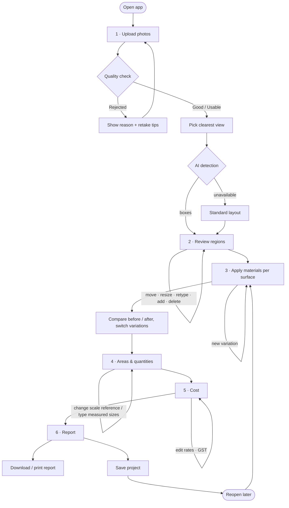

# User workflow

The app is a six-step guided flow. The steps stay clickable, so the user can go back at any point (for example, adjust a region after seeing its cost), and everything downstream recalculates.

## Steps in detail

| # | Step | What the user does | What the system does |
|---|---|---|---|
| 1 | **Upload** | Drops one or more photos, or uses the sample house | Scores each photo on resolution, light and sharpness. Rejects unusable ones with a reason and a retake tip. Auto-selects the best view. |
| – | **Identify structure** | Waits a few seconds | Sends a 1024 px copy to a vision model on Groq, which returns boxes for walls, windows, gates, balcony railings, balcony slabs, pillars, parapet and roof edge. It also flags photos that aren't a house or aren't usable. |
| 2 | **Review regions** | Drags, resizes (any corner), nudges with arrow keys, retypes, adds or deletes boxes | Shows each region's size in feet live |
| 3 | **Apply materials** | Picks a surface, then a material and finish. Can apply to one surface or every surface of that type, and can add variations. | Renders the redesign on the photo. Shows durability, upkeep, suitability and rates. Each variation gets a thumbnail and a running total. |
| 4 | **Areas & quantities** | Picks the scale reference, pillar faces, and optionally types tape-measured widths and heights | Shows net areas, running lengths, and quantities with their formulas |
| 5 | **Cost** | Edits material, labour and wastage rates; toggles GST | Shows material, labour and total per category, and the grand total, all updating live |
| 6 | **Report** | Downloads the report, prints it to PDF, or saves the project | Builds a contractor-ready document: both images, materials, quantities, costs, rates and the basis of the estimate |

## Saving and sharing

- The **Save project** button in the header works at any step.
- Projects are kept in the browser. **Projects** lists them with a thumbnail and date, and each can be opened or deleted.
- To share with a contractor, use the downloaded report.
